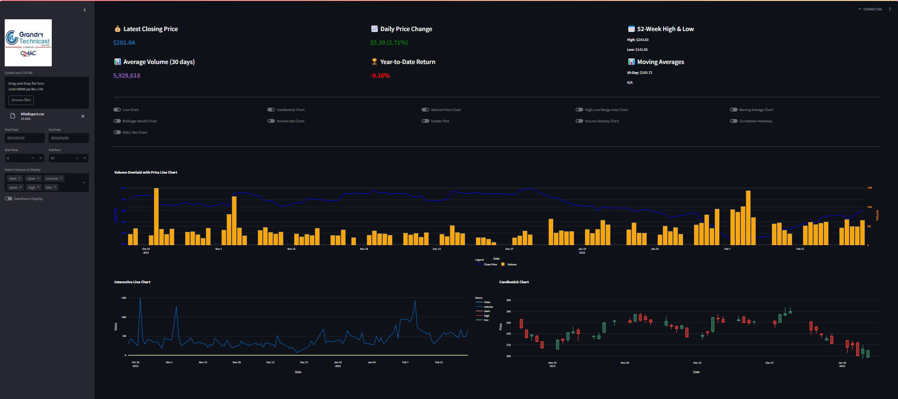
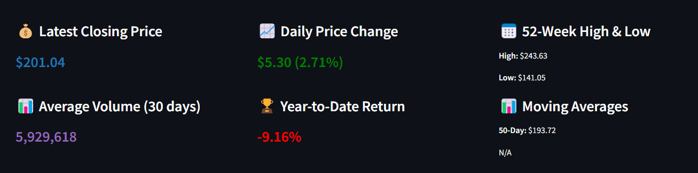
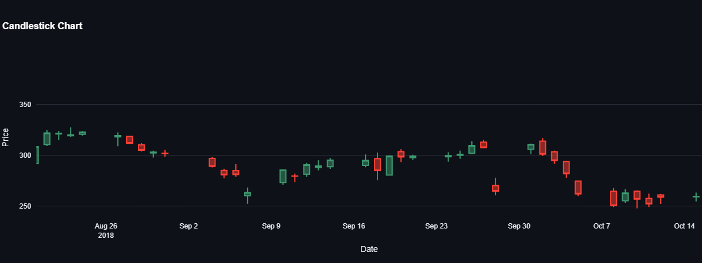
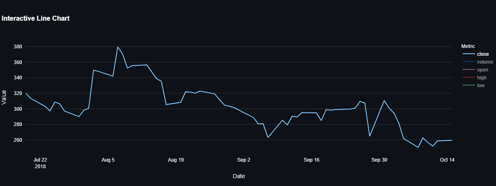

---

# 📊 CSV Viewer and Visualizer

This **Streamlit** application allows users to upload and interactively explore CSV files. It includes features for data filtering, visualization, and key performance indicator (KPI) analysis.

---

## Features
- **File Upload**: Upload CSV files for analysis.
- **Data Filtering**:
  - Filter data by date range.
  - Select specific rows or columns.
- **Key Performance Indicators (KPIs)**:
  - Latest Closing Price
  - Daily Price Change (Absolute and Percentage)
  - 52-Week High and Low
  - Average Volume (30 days)
  - Year-to-Date (YTD) Return
  - Moving Averages (50-day and 200-day)
- **Interactive Visualizations**:
  - Line Chart
  - Candlestick Chart
  - Volume Bar Chart
  - Bollinger Bands
  - Moving Averages
  - Scatter Plot
  - High-Low Range Area Chart
  - OHLC Bar Chart
  - Correlation Heatmap
- **Customizable User Inputs**:
  - Select columns, chart types, and filters through an intuitive sidebar.

---

## Demo
Try the app live at: [CSV Viewer App](https://stockdatavisualizerwebapp.streamlit.app)

---

## Installation

Follow these steps to set up and run the project locally:

1. **Clone the repository**:
   ```bash
   git clone https://github.com/waqarulwahab/stock_data_visualizer_web_app.git
   cd csv-viewer
   ```

2. **Create and activate a virtual environment**:
   ```bash
   python -m venv venv
   source venv/bin/activate  # On Windows: venv\Scripts\activate
   ```

3. **Install dependencies**:
   ```bash
   pip install -r requirements.txt
   ```

4. **Run the application**:
   ```bash
   streamlit run main.py
   ```

5. **Access the app**:
   - Open your browser and go to `http://localhost:8501`.

---

## Project Structure

```
csv-viewer/
├── main.py                   # Main application script
├── kpis.py                   # Key Performance Indicators logic
├── data_processing.py        # File reading and validation
├── filters.py                # Data filtering functions
├── visualizations.py         # Chart rendering functions
├── display.py                # Dataframe display logic
├── user_inputs.py            # User input handling
├── requirements.txt          # Dependencies
├── README.md                 # Project documentation
└── assets/                   # Logo and additional resources
```

---

## Requirements

- **Python 3.8+**
- **Streamlit**
- **Pandas**
- **Plotly**

Install all dependencies with:
```bash
pip install -r requirements.txt
```

---

## Usage

1. **Upload CSV File**:
   - Upload a file with columns like `date`, `close`, `volume`, `open`, `high`, and `low`.

2. **Filter Data**:
   - Use the sidebar to filter by date range, rows, or specific columns.

3. **View KPIs**:
   - KPIs like closing price, volume, and performance metrics are displayed dynamically.

4. **Select Charts**:
   - Choose from various interactive visualizations like line charts, candlestick charts, and more.

---

## Screenshots

### Homepage:


### KPI Section:


### Charts:



---

## Contributing

Contributions are welcome! Feel free to submit a pull request or open an issue for any improvements or bug fixes.

---

## License

This project is licensed under the [MIT License](LICENSE).

---

## Author
- [GitHub](https://github.com/waqarulwahab)  
- [LinkedIn](https://www.linkedin.com/in/waqar-ul-wahab-software-engineer)

---
